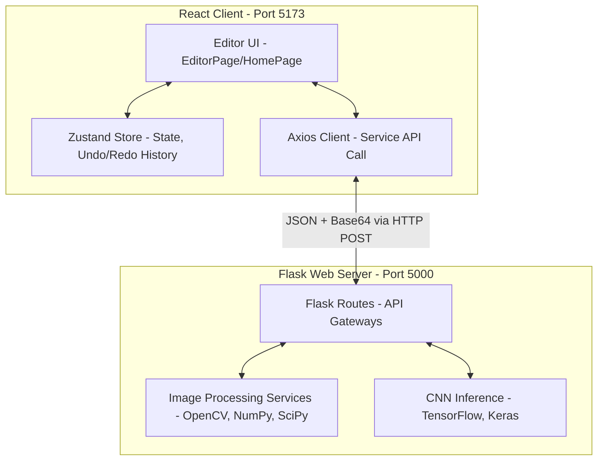

# DOKUMEN TEKNIS REKAYASA PERANGKAT LUNAK

## HALAMAN JUDUL
* **Nama Proyek:** PixelForge: Advanced Digital Image Processing Platform
* **Nama Organisasi/Instansi:** Program Studi Teknik Informatika, Fakultas Teknik
* **Versi Dokumen:** 1.0.0
* **Tanggal Penyusunan:** 9 Juni 2026
* **Penyusun:** Tim Pengembang PixelForge

---

## RIWAYAT REVISI

| Versi | Tanggal | Deskripsi Perubahan | Penyusun |
| :--- | :--- | :--- | :--- |
| 1.0.0 | 09/06/2026 | Inisiasi dokumen teknis awal, pemetaan arsitektur, dan analisis kebutuhan lengkap. | Tim Pengembang PixelForge |

---

## DAFTAR ISI
1. [BAB 1. PENDAHULUAN](#bab-1-pendahuluan)
   - 1.1 Latar Belakang
   - 1.2 Tujuan Pengembangan
   - 1.3 Ruang Lingkup Sistem
   - 1.4 Definisi, Akronim, dan Singkatan
   - 1.5 Referensi
2. [BAB 2. GAMBARAN UMUM SISTEM](#bab-2-gambaran-umum-sistem)
   - 2.1 Deskripsi Sistem
   - 2.2 Arsitektur Sistem
3. [BAB 3. ANALISIS KEBUTUHAN](#bab-3-analisis-kebutuhan)
   - 3.1 Kebutuhan Fungsional
   - 3.2 Kebutuhan Non-Fungsional
   - 3.3 Kebutuhan Perangkat Keras
   - 3.4 Kebutuhan Perangkat Lunak
4. [BAB 4. DESAIN SISTEM](#bab-4-desain-sistem)
   - 4.1 Use Case Diagram
   - 4.2 Entity Relationship Diagram (ERD)
   - 4.3 Desain API
5. [BAB 5. DESAIN ANTARMUKA](#bab-5-desain-antarmuka)
   - 5.1 Standar Desain UI/UX
   - 5.2 Mockup Halaman
   - 5.3 Navigasi Sistem
6. [BAB 6. IMPLEMENTASI](#bab-6-implementasi)
   - 6.1 Teknologi yang Digunakan
7. [BAB 7. PENGUJIAN DAN DOKUMENTASI](#bab-7-pengujian-dan-dokumentasi)
   - 7.1 Strategi Pengujian
   - 7.2 Skenario Pengujian
   - 7.3 Hasil Pengujian
   - 7.4 Dokumentasi Sistem
8. [BAB 8. PENUTUP](#bab-8-penutup)
   - 8.1 Kesimpulan
   - 8.2 Rencana Pengembangan Lanjutan
9. [LAMPIRAN](#lampiran)
   - Lampiran A. Diagram Lengkap
   - Lampiran B. Struktur Basis Data
   - Lampiran C. Dokumentasi API
   - Lampiran D. Hasil Pengujian
   - Lampiran E. Dokumentasi Sistem

---

## BAB 1. PENDAHULUAN

### 1.1 Latar Belakang
Pengolahan Citra Digital (PCD) merupakan salah satu mata kuliah penting dalam bidang informatika dan ilmu komputer. Konsep-konsep seperti peningkatan kualitas citra (*image enhancement*), transformasi geometris, filtrasi spasial (*restoration*), deteksi tepi (*edge detection*), morfologi citra, segmentasi, hingga kompresi data gambar merupakan teori dasar yang sering kali sulit divisualisasikan oleh mahasiswa tanpa alat bantu praktis.

Aplikasi editor gambar yang ada saat ini (seperti Adobe Photoshop atau GIMP) sangat kaya akan fitur, namun bersifat *closed-source* atau sulit diintegrasikan dengan kode-kode algoritma kustom yang diajarkan di kelas. Di sisi lain, kode pemrograman mentah menggunakan library seperti OpenCV Python sulit dioperasikan oleh pengguna awam tanpa antarmuka grafis yang interaktif. 

Oleh karena itu, dikembangkan **PixelForge**, sebuah platform pengolahan citra digital berbasis web yang menggabungkan kekuatan komputasi matriks OpenCV di sisi backend (Python Flask) dengan antarmuka pengguna interaktif modern berkinerja tinggi di sisi frontend (React). Aplikasi ini juga menambahkan teknologi kecerdasan buatan berbasis *Convolutional Neural Network* (CNN) untuk rekognisi simbol tangan sebagai nilai tambah implementasi kecerdasan buatan dalam pengolahan citra.

### 1.2 Tujuan Pengembangan
Tujuan dari pengembangan sistem PixelForge adalah:
1. Menyediakan aplikasi berbasis web (*web platform*) yang interaktif untuk mengimplementasikan dan menguji berbagai algoritma Pengolahan Citra Digital secara *real-time*.
2. Memvisualisasikan perubahan citra sebelum (*before*) dan sesudah (*after*) proses transformasi dalam satu panel berdampingan secara responsif.
3. Memberikan representasi matematis dari citra dalam bentuk histogram grayscale dan informasi statistik piksel secara langsung.
4. Mengimplementasikan model klasifikasi kecerdasan buatan CNN untuk mengenali bentuk/simbol tangan berupa angka 0-9 dari gambar masukan.
5. Membantu proses pembelajaran mata kuliah Pengolahan Citra Digital dengan visualisasi parameter yang dinamis (menggunakan slider dan panel kontrol UI).

### 1.3 Ruang Lingkup Sistem
Sistem PixelForge dibatasi oleh ruang lingkup berikut:
1. **Stateless Processing:** Sistem dirancang tanpa database relasional maupun non-relasional. Gambar dikirim dari client ke server dalam bentuk string terenkripsi *Base64* via protokol HTTP JSON, diproses di memori server, dan langsung dikembalikan sebagai respons Base64 tanpa disimpan secara permanen di server maupun database (*stateless*).
2. **Penyimpanan State Riwayat:** Logika *Undo/Redo* riwayat edit dikelola sepenuhnya di sisi frontend (*client-side memory*) menggunakan pustaka state management Zustand.
3. **Format Berkas:** Berkas gambar yang didukung untuk diunggah adalah JPG, JPEG, PNG, dan BMP.
4. **Modul Fitur Utama:**
   - **Image Management:** Upload, save format/filename kustom, dan reset ke gambar asli.
   - **Image Enhancement:** Brightness, Contrast, Histogram Equalization, Sharpening, dan Smoothing.
   - **Geometric Transformation:** Rotasi (0°–360°), Flip (h/v), Crop, Resize, dan Translasi (shift) dengan pilihan interpolasi *nearest* atau *bilinear*.
   - **Image Restoration:** Gaussian Blur, Median Filter, dan filter khusus untuk menghilangkan noise Salt & Pepper.
   - **Binary & Edge Processing:** Thresholding biner global, deteksi tepi (Canny, Sobel, Prewitt, Robert, Laplacian, Laplacian of Gaussian), dan operasi morfologi (Erosion, Dilation).
   - **Color Processing:** RGB ke Grayscale, Channel splitting (pemisahan kanal merah, hijau, biru), serta penyesuaian Hue/Saturation.
   - **Image Segmentation:** Segmentasi berbasis Threshold, berbasis Edge (Canny + pengisian kontur), dan berbasis Region menggunakan algoritma clustering K-Means.
   - **Image Compression:** Simulasi kompresi JPEG dengan estimasi ukuran byte berdasarkan metode RLE, Huffman, LZW, dan Kuantisasi.
   - **Histogram Analysis:** Grafik distribusi frekuensi warna grayscale sebelum dan sesudah pengolahan citra.
   - **CNN Object Recognition:** Deteksi simbol tangan angka 0-9 menggunakan model Deep Learning Sequential CNN yang dilatih dengan TensorFlow/Keras.

### 1.4 Definisi, Akronim, dan Singkatan
* **PCD / DIP:** Pengolahan Citra Digital / *Digital Image Processing*.
* **CNN:** *Convolutional Neural Network*, arsitektur jaringan saraf tiruan dalam deep learning yang sangat baik dalam mendeteksi dan mengklasifikasi objek gambar.
* **Base64:** Skema pengodean biner-ke-teks yang merepresentasikan data biner dalam format string ASCII, digunakan untuk mentransfer file gambar dalam payload JSON API.
* **REST API:** *Representational State Transfer Application Programming Interface*, arsitektur komunikasi web service stateless berbasis protokol HTTP.
* **Zustand:** Pustaka manajemen state minimalis untuk React yang digunakan mengelola stack riwayat *Undo/Redo*.
* **OpenCV:** *Open Source Computer Vision Library*, pustaka perangkat lunak pemrograman untuk pengolahan citra komputer secara real-time.
* **DCT:** *Discrete Cosine Transform*, algoritma transformasi kosinus diskrit yang membagi citra ke dalam frekuensi spektral berbeda, digunakan dalam simulasi JPEG.

### 1.5 Referensi
1. Gonzales, R. C., & Woods, R. E. (2018). *Digital Image Processing* (4th Edition). Pearson.
2. OpenCV Official Documentation (https://docs.opencv.org/).
3. Flask Python Framework Documentation (https://flask.palletsprojects.com/).
4. React Vite Web Development Guidelines (https://vitejs.dev/).
5. TensorFlow & Keras Model Training Manuals (https://keras.io/).

---

## BAB 2. GAMBARAN UMUM SISTEM

### 2.1 Deskripsi Sistem
PixelForge adalah platform pemrosesan citra digital canggih berbasis client-server. Hubungan antara frontend dan backend bersifat longgar (*decoupled*), terhubung melalui Web API RESTful yang aman. Pengguna berinteraksi dengan antarmuka bergaya studio editor gelap (*Dark Mode Cyberpunk Theme*). Ketika gambar diunggah, ia diubah menjadi string Base64 di memori browser. 

Setiap kali pengguna menggeser slider (seperti Brightness) atau menerapkan filter deteksi tepi, frontend mengirimkan payload JSON berisi representasi Base64 dari citra yang aktif beserta parameter numerik filter tersebut ke backend Flask. Backend Flask mendekode Base64 menjadi array multi-dimensi NumPy, menerapkan fungsi komputasi matriks OpenCV, mengodekan kembali hasilnya ke string Base64, lalu mengirimkannya kembali ke browser dalam milidetik. Hal ini memberikan pengalaman pengguna yang sangat cepat tanpa perlu membebani memori server untuk menyimpan file.

### 2.2 Arsitektur Sistem
Sistem ini menggunakan arsitektur **Stateless Client-Server** dengan detail pemisahan layer sebagai berikut:



* **Client Layer (React):** Bertanggung jawab merender antarmuka pengguna (UI), menampilkan grafik histogram interaktif (menggunakan Recharts), menangani unggah/unduh file secara lokal di komputer pengguna, serta menyimpan tumpukan riwayat modifikasi (*undo/redo stack*) di Zustand Store.
* **API Gateway Layer (Flask Routes):** Bertanggung jawab memetakan endpoint URL, melakukan validasi ukuran payload dan format masukan data, serta memformat output respons JSON standar.
* **Business Logic Layer (Python Services):** Bertanggung jawab mengeksekusi semua operasi aritmatika piksel, konvolusi kernel filter, transformasi koordinat matriks affin, ekstraksi klaster segmentasi K-Means, serta estimasi entropi kompresi citra.
* **ML Inference Layer (TensorFlow/Keras):** Memuat berkas bobot model terlatih (`weights.h5`) dan berkas konfigurasi arsitektur JSON untuk memprediksi angka simbol tangan berdasarkan citra input.

---

## BAB 3. ANALISIS KEBUTUHAN

### 3.1 Kebutuhan Fungsional

#### KF-01: Image Management (Manajemen Gambar)
* **Deskripsi:** Mengunggah citra digital dari komputer lokal ke sistem, menyimpan hasil transformasi ke komputer lokal, dan mengembalikan citra ke bentuk semula sebelum dimodifikasi.
* **Input:** File berkas gambar (JPG, JPEG, PNG, BMP) dari sistem lokal.
* **Proses:** Membaca berkas gambar menggunakan `FileReader` di browser, mengonversinya menjadi string Base64, menyimpannya di Zustand Store, mengirimkannya ke backend Flask untuk diverifikasi validitasnya, dan menyediakan fungsi unduh (menggunakan link unduhan tersembunyi dengan nama file kustom) serta fungsi reset (mengosongkan stack riwayat penyuntingan).
* **Output:** Preview gambar di kanvas utama, file unduhan hasil modifikasi, atau kembalinya tampilan ke gambar asli.

#### KF-02: Image Enhancement (Peningkatan Kualitas Citra)
* **Deskripsi:** Meningkatkan kecerahan, kontras, menyeimbangkan histogram secara otomatis, mempertajam gambar, dan menghaluskan gambar secara dinamis dengan slider parameter.
* **Input:** Gambar aktif (Base64) dan parameter numerik (nilai slider Brightness/Contrast -100 s/d 100, level Sharpening 1-5, level Smoothing/Blur 1-10).
* **Proses:**
  - *Brightness:* Menambahkan nilai offset konstan ke setiap piksel menggunakan `np.clip`.
  - *Contrast:* Melakukan skala nilai piksel menggunakan formula rasio kontras non-linear.
  - *Histogram Equalization:* Meratakan distribusi intensitas piksel dengan `cv2.equalizeHist` (baik grayscale maupun pada saluran Y pada ruang warna YUV untuk citra berwarna).
  - *Sharpening:* Menerapkan filter linear dengan matriks kernel penajaman kustom via `cv2.filter2D`.
  - *Smoothing:* Menerapkan filter Gaussian blur secara linear dengan kernel yang bertambah sesuai level.
* **Output:** Gambar hasil peningkatan kualitas yang ter-update di layar secara *real-time*.

#### KF-03: Geometric Transformation (Transformasi Geometris)
* **Deskripsi:** Memutar, membalik arah, memotong area tertentu, mengubah ukuran piksel, dan menggeser koordinat citra dengan pilihan algoritma interpolasi.
* **Input:** Gambar aktif (Base64), parameter rotasi (derajat 0-360), arah flip ('h' atau 'v'), koordinat crop (x, y, w, h), resolusi resize (lebar, tinggi), translasi (tx, ty), dan tipe interpolasi ('nearest' atau 'bilinear').
* **Proses:** Menerapkan transformasi affine pada koordinat piksel gambar menggunakan matriks rotasi/translasi dengan fungsi `cv2.warpAffine` dan `cv2.resize` dengan bendera interpolasi `cv2.INTER_NEAREST` atau `cv2.INTER_LINEAR`.
* **Output:** Gambar hasil transformasi geometris di kanvas editor.

#### KF-04: Image Restoration (Restorasi / Reduksi Derau)
* **Deskripsi:** Merestorasi gambar dari derau/noise menggunakan berbagai pilihan filter pemulusan non-linear maupun linear.
* **Input:** Gambar aktif (Base64) dan ukuran kernel (3x3, 5x5, 7x7).
* **Proses:** Menerapkan algoritma konvolusi kernel spasial:
  - *Gaussian Blur:* Pemulusan linier pembobotan Gaussian.
  - *Median Filter:* Pemulusan non-linier untuk mengganti nilai piksel dengan nilai median tetangganya (sangat efektif untuk noise Salt & Pepper).
* **Output:** Gambar bersih dari noise di panel hasil.

#### KF-05: Binary & Edge Processing (Deteksi Tepi & Morfologi)
* **Deskripsi:** Mengubah citra grayscale menjadi hitam-putih biner (*Thresholding*), melakukan deteksi kontur tepi luar gambar dengan berbagai metode, serta menerapkan operasi morfologi biner.
* **Input:** Gambar aktif (Base64), nilai ambang batas threshold (0-255), metode deteksi tepi ('canny', 'sobel', 'prewitt', 'robert', 'laplacian', 'log'), dan operasi morfologi ('erode', 'dilate') beserta bentuk structuring element.
* **Proses:**
  - *Thresholding:* Menerapkan `cv2.threshold` global biner.
  - *Edge Detection:* Menghitung gradien piksel menggunakan operator diferensiasi orde pertama (Sobel, Prewitt, Robert) atau orde kedua (Laplacian, LoG) atau hysteresis thresholding (Canny).
  - *Morphology:* Menerapkan operasi pengikisan batas (*Erosion*) atau penebalan batas (*Dilation*) dengan structuring element menggunakan `cv2.morphologyEx`.
* **Output:** Citra biner atau citra tepi berlatar belakang hitam di panel utama.

#### KF-06: Color Processing (Pengolahan Warna)
* **Deskripsi:** Mengubah citra RGB berwarna menjadi citra abu-abu (grayscale), memisahkan kanal warna primer, dan menyetel tingkat warna (Hue/Saturation).
* **Input:** Gambar aktif (Base64), pilihan kanal ('r', 'g', 'b'), representasi kanal ('grayscale' atau 'colored'), serta derajat pergeseran Hue dan Saturation.
* **Proses:**
  - *Grayscale:* Melakukan ekstraksi luminans piksel berbasis formula standar ITU-R BT.601.
  - *Channel Splitting:* Memisahkan elemen array warna citra 3D menjadi array 2D terisolasi.
  - *Hue/Saturation:* Mengonversi ruang warna citra BGR ke HSV (`cv2.COLOR_BGR2HSV`), memodifikasi saluran H dan S, lalu mengonversinya kembali ke BGR.
* **Output:** Citra satu warna, grayscale, atau dengan saturasi warna yang berubah.

#### KF-07: Image Segmentation (Segmentasi Citra)
* **Deskripsi:** Memisahkan objek utama dari latar belakang menggunakan berbagai pendekatan segmentasi.
* **Input:** Gambar aktif (Base64), nilai threshold, parameter Canny, jumlah klaster K-Means (2 s/d 8), dan klaster target yang ingin diekstraksi.
* **Proses:**
  - *Threshold Segmentation:* Membuat masker biner global lalu menerapkannya pada citra asli dengan operasi bitwise-AND.
  - *Edge Segmentation:* Melacak kontur luar citra menggunakan `cv2.findContours` pasca deteksi tepi Canny, kemudian menggambar kontur yang terisi penuh sebagai masker pemisah objek.
  - *Region Segmentation (K-Means):* Mengelompokkan piksel sewarna ke dalam K klaster pusat warna menggunakan `cv2.kmeans`.
* **Output:** Citra hasil segmentasi objek terpilih atau penyederhanaan warna citra.

#### KF-08: Image Compression (Kompresi Citra)
* **Deskripsi:** Menguji dan mensimulasikan hasil kompresi kualitas JPEG dan membandingkan hasil estimasi ukuran file.
* **Input:** Gambar aktif (Base64), tingkat kualitas kompresi (1-100), dan metode pengodean ('huffman', 'rle', 'lzw', 'arithmetic').
* **Proses:** Melakukan konversi warna BGR ke YCbCr, membagi citra ke dalam blok 8x8 piksel, mengeksekusi DCT (Discrete Cosine Transform) pada setiap blok, membagi hasil DCT dengan matriks kuantisasi standar JPEG yang telah disesuaikan kualitasnya, merangkai hasil kuantisasi dalam urutan zig-zag, dan mengestimasi ukuran kompresi menggunakan simulasi matematika dari masing-masing algoritma pengodean entropi (RLE, Huffman, LZW, Arithmetic).
* **Output:** Gambar terkompresi dengan kompresi lossy dan statistik rasio kompresi, ukuran file lama/baru, serta persentase penghematan ruang penyimpanan (*space savings*).

#### KF-09: Histogram Analysis (Analisis Histogram)
* **Deskripsi:** Menampilkan visualisasi grafis distribusi tingkat intensitas piksel gambar untuk perbandingan citra sebelum dan sesudah diproses.
* **Input:** Gambar asli (Base64) dan gambar aktif hasil modifikasi (Base64).
* **Proses:** Menghitung jumlah piksel untuk setiap nilai intensitas warna (0-255) menggunakan `cv2.calcHist`. Backend mengembalikan data array frekuensi intensitas warna yang kemudian digambar sebagai grafik area (*Area Chart*) interaktif menggunakan pustaka Recharts di frontend.
* **Output:** Grafik histogram interaktif *Before* (sisi kiri) dan *After* (sisi kanan) yang langsung berubah setiap kali ada pengolahan citra diterapkan.

#### KF-10: User Interface Interaction (Antarmuka Pengguna)
* **Deskripsi:** Menyediakan kontrol terpadu yang terstruktur layaknya workspace Adobe Photoshop.
* **Input:** Interaksi klik menu, dropdown, perpindahan tab, drag slider, serta tombol aksi cepat.
* **Proses:** Menampilkan layout gelap dengan topbar menu (File, Edit, Filter, Transform, Segment, ML CNN), menampilkan Before/After panel secara side-by-side, menampilkan panel statistik (dimensi gambar, warna), serta menyediakan navigasi riwayat Undo/Redo dengan tombol cepat.
* **Output:** Antarmuka responsif yang interaktif dan dinamis.

#### KF-11: CNN Object Recognition (Pengenalan Objek CNN)
* **Deskripsi:** Mengidentifikasi bentuk isyarat/simbol tangan berupa angka 0-9 menggunakan kecerdasan buatan CNN secara otomatis.
* **Input:** Gambar aktif (Base64) yang berisi isyarat simbol tangan angka.
* **Proses:** Mengubah ukuran gambar masukan menjadi 100x100 piksel, melakukan normalisasi nilai piksel (0 s/d 1), mengirimkan gambar ke model deep learning CNN terkompilasi, menghitung probabilitas softmax untuk 10 kelas output (angka 0 s/d 9), menentukan label prediksi dengan nilai probabilitas tertinggi (`np.argmax`), dan optionally menggambar overlay teks prediksi di atas gambar.
* **Output:** String teks label angka hasil prediksi (0-9) beserta tingkat kepercayaan (*confidence percentage*) dan gambar overlay hasil deteksi.

---

### 3.2 Kebutuhan Non-Fungsional

| Kode | Kebutuhan | Deskripsi Kebutuhan |
| :--- | :--- | :--- |
| **KNF-01** | Kompatibilitas Browser | Sistem harus dapat diakses dan berfungsi penuh pada semua peramban (*browser*) modern standar (Google Chrome, Mozilla Firefox, Microsoft Edge, Safari) yang mendukung JavaScript ES6+ dan HTML5 Canvas. |
| **KNF-02** | Waktu Respons (*Response Time*) | Rata-rata waktu respons server untuk operasi pengolahan citra dasar (seperti filter linear, transformasi) harus kurang dari **1.5 detik** pada kondisi jaringan lokal/intranet normal. Untuk proses segmentasi K-Means dan inferensi CNN, waktu respon maksimal **3 detik**. |
| **KNF-03** | Portabilitas / Stateless | Sistem tidak boleh mempertahankan status pengguna (*stateless*) di server, sehingga sistem sangat mudah dideploy di berbagai infrastruktur cloud (Docker, VPS) tanpa perlu sinkronisasi database/storage stateful. |
| **KNF-04** | Keamanan Payload | Sistem membatasi ukuran maksimal payload unggahan gambar sebesar **50 MB** untuk mencegah serangan *Denial of Service (DoS)* berbasis unggahan berkas berukuran raksasa. |
| **KNF-05** | Antarmuka Responsif (Aesthetics) | Antarmuka pengguna harus menggunakan standar visual bernilai estetika tinggi dengan kombinasi skema warna bertema Cyberpunk Dark Mode (latar belakang navy gelap dengan aksen neon cyan dan ungu) yang nyaman digunakan dalam waktu lama (*low eye-strain*). |

---

### 3.3 Kebutuhan Perangkat Keras
Untuk menjalankan aplikasi PixelForge dengan lancar, berikut spesifikasi perangkat keras minimum dan rekomendasi:

* **Sisi Server (Backend & Hosting):**
  - **Prosesor (CPU):** Intel Core i3 / AMD Ryzen 3 (Minimum); Intel Core i5 / AMD Ryzen 5 ke atas (Rekomendasi, untuk memproses K-Means & training CNN).
  - **Memori (RAM):** 4 GB RAM (Minimum); 8 GB RAM ke atas (Rekomendasi).
  - **Penyimpanan:** Ketersediaan ruang penyimpanan kosong minimal 1 GB (untuk instalasi dependensi TensorFlow dan Python packages).
* **Sisi Klien (User Device):**
  - **Prosesor:** Dual Core CPU 1.6 GHz ke atas.
  - **Memori (RAM):** 2 GB RAM (Minimum); 4 GB RAM (Rekomendasi).
  - **Resolusi Monitor:** 1280 x 720 piksel (Minimum); 1920 x 1080 piksel (Rekomendasi untuk kenyamanan tata letak panel editor).

---

### 3.4 Kebutuhan Perangkat Lunak
Kebutuhan perangkat lunak lingkungan pengembangan (*development environment*) dan produksi adalah:

* **Sisi Server (Backend):**
  - **Sistem Operasi:** Windows 10/11, Linux (Ubuntu/Debian), atau macOS.
  - **Bahasa Pemrograman:** Python Versi 3.10 atau 3.11.
  - **Pustaka Utama:** Flask, Flask-CORS, OpenCV-Python-Headless, Pillow, NumPy, SciPy, Matplotlib, TensorFlow-CPU, Keras.
* **Sisi Klien (Frontend):**
  - **Lingkungan Eksekusi:** Node.js (Versi 18 atau 20) untuk build frontend.
  - **Teknologi Utama:** React 19 (atau React 18), Vite, Zustand, Tailwind CSS, Lucide-React, Recharts, Framer Motion.
  - **Peramban:** Google Chrome, Firefox, atau Edge versi terbaru.

---

## BAB 4. DESAIN SISTEM

### 4.1 Use Case Diagram

#### 4.1.1 Identifikasi Aktor
Dalam sistem PixelForge, hanya terdapat **1 Aktor Utama**:
* **Pengguna (User):** Aktor yang berinteraksi langsung dengan aplikasi untuk mengunggah gambar, memanipulasi citra dengan berbagai filter, melihat hasil analisis grafik histogram, menguji deteksi model CNN, dan mengunduh berkas gambar hasil akhir.

#### 4.1.2 Deskripsi Use Case

| Use Case | Aktor | Deskripsi |
| :--- | :--- | :--- |
| **Unggah Gambar** | Pengguna | Pengguna memilih berkas gambar dari folder lokal komputer mereka dan memuatnya ke dalam editor PixelForge. |
| **Peningkatan Kualitas (Enhancement)** | Pengguna | Pengguna mengatur kecerahan, kontras, ketajaman, pemulusan, atau pemerataan histogram pada gambar. |
| **Transformasi Geometris** | Pengguna | Pengguna memutar, memotong (*crop*), membalik (*flip*), menggeser (*translate*), atau mengubah dimensi gambar (*resize*). |
| **Restorasi Citra** | Pengguna | Pengguna menerapkan filter pembersih derau (Gaussian/Median) untuk mereduksi noise pada citra. |
| **Deteksi Tepi & Morfologi** | Pengguna | Pengguna menerapkan deteksi garis tepi (Canny, Sobel, dll.) atau operasi biner thresholding dan morfologi. |
| **Pengolahan Warna** | Pengguna | Pengguna mengubah citra berwarna ke abu-abu, memecah kanal RGB, atau mengubah nilai Hue/Saturation. |
| **Segmentasi Objek** | Pengguna | Pengguna memisahkan objek gambar berdasarkan threshold, tepi, atau clustering K-Means. |
| **Simulasi Kompresi** | Pengguna | Pengguna mensimulasikan hasil kompresi kualitas JPEG dan membandingkan hasil estimasi ukuran file. |
| **Analisis Histogram** | Pengguna | Pengguna melihat grafik sebaran intensitas piksel citra asli vs citra modifikasi secara *real-time*. |
| **Pengenalan Simbol Tangan CNN** | Pengguna | Pengguna menekan tombol prediksi untuk memproses citra tangan melalui neural network dan menampilkan hasil angka 0-9. |
| **Unduh Gambar Hasil** | Pengguna | Pengguna mengekspor hasil suntingan gambar aktif ke dalam file format PNG/JPG dengan nama berkas kustom. |
| **Reset Editor / Undo-Redo** | Pengguna | Pengguna membatalkan aksi pengeditan terakhir atau mengembalikan editor ke keadaan awal gambar diunggah. |

---

### 4.2 Entity Relationship Diagram (ERD)
> [!IMPORTANT]  
> **Catatan Arsitektur:** Sistem PixelForge dirancang dengan arsitektur **Stateless API**. Sistem **TIDAK MENGGUNAKAN DATABASE** persistent di sisi server. 
> 
> Tidak ada penyimpanan data pengguna maupun data citra di server pasca transaksi request selesai. Seluruh data citra dikomunikasikan dalam bentuk payload string Base64 terenkripsi secara langsung dari sisi klien. Adapun riwayat operasi sunting (*Undo-Redo stack*) dikelola di RAM browser klien menggunakan Zustand Store. 
> 
> Karena tidak ada database relasional/tabel basis data yang didefinisikan dalam sistem ini, maka desain skema Entity Relationship Diagram (ERD) bersifat **tidak tersedia (not applicable / N/A)**.

---

### 4.3 Desain API
Semua endpoint bertipe stateless, menerima payload berformat JSON dan mengembalikan respons JSON. Berikut adalah daftar endpoint API utama backend Flask:

#### 1. Image Management Endpoints
* **Endpoint:** `/api/image/upload`
  - **Method:** `POST`
  - **Request Payload:**
    ```json
    { "image": "<base64_string_here>" }
    ```
  - **Response (Success 200):**
    ```json
    { "status": "ok", "result_image": "<base64_string_here>" }
    ```

#### 2. Image Enhancement Endpoints
* **Endpoint:** `/api/enhancement/brightness`
  - **Method:** `POST`
  - **Request Payload:**
    ```json
    { "image": "<base64_string>", "value": 25 }
    ```
  - **Response (Success 200):**
    ```json
    { "status": "ok", "result_image": "<base64_processed_string>" }
    ```
* **Endpoint:** `/api/enhancement/contrast`
  - **Method:** `POST`
  - **Request Payload:**
    ```json
    { "image": "<base64_string>", "value": -15 }
    ```
  - **Response (Success 200):**
    ```json
    { "status": "ok", "result_image": "<base64_processed_string>" }
    ```

#### 3. Geometric Transformation Endpoints
* **Endpoint:** `/api/transform/rotate`
  - **Method:** `POST`
  - **Request Payload:**
    ```json
    { "image": "<base64_string>", "angle": 90, "interpolation": "bilinear" }
    ```
  - **Response (Success 200):**
    ```json
    { "status": "ok", "result_image": "<base64_processed_string>" }
    ```

#### 4. Edge & Binary Endpoints
* **Endpoint:** `/api/edge/detect`
  - **Method:** `POST`
  - **Request Payload:**
    ```json
    { "image": "<base64_string>", "method": "canny", "low": 50, "high": 150 }
    ```
  - **Response (Success 200):**
    ```json
    { "status": "ok", "result_image": "<base64_processed_string>" }
    ```

#### 5. Image Segmentation Endpoints
* **Endpoint:** `/api/segment/region`
  - **Method:** `POST`
  - **Request Payload:**
    ```json
    { "image": "<base64_string>", "clusters": 4, "target_cluster": null }
    ```
  - **Response (Success 200):**
    ```json
    { "status": "ok", "result_image": "<base64_processed_string>" }
    ```

#### 6. ML CNN Object Recognition Endpoints
* **Endpoint:** `/api/cnn/predict`
  - **Method:** `POST`
  - **Request Payload:**
    ```json
    { "image": "<base64_string>", "overlay": true }
    ```
  - **Response (Success 200):**
    ```json
    {
      "status": "ok",
      "predicted_class": 5,
      "confidence": 98.42,
      "result_image": "<base64_processed_string_with_text_overlay>"
    }
    ```

---

## BAB 5. DESAIN ANTARMUKA

### 5.1 Standar Desain UI/UX
PixelForge dirancang mengikuti panduan antarmuka modern kelas profesional dengan prinsip estetika tinggi:
1. **Cyberpunk Dark Theme:** Warna dominan latar belakang adalah gelap pekat (`#0D1117` dan `#111827`) untuk mencegah kelelahan mata (*eye fatigue*) saat bekerja dengan kecerahan gambar yang bervariasi.
2. **Glassmorphism Panels:** Setiap panel menggunakan efek kaca transparan (*backdrop blur*) dengan garis tepi (*border*) neon tipis berwarna abu-abu/cyan transparan (`rgba(255, 255, 255, 0.05)`), menciptakan kedalaman dimensi visual yang premium.
3. **Neon Accents:** Warna aksen fungsional menggunakan warna neon khusus:
   - *Cyber Cyan (`#06B6D4`):* Untuk indikator aktif, status pemrosesan citra, dan nilai utama.
   - *Cyber Purple (`#7C3AED`):* Untuk aksi transformatif, navigasi primer, dan penyorotan penting.
   - *Cyber Pink (`#EC4899`):* Untuk fitur khusus deep learning CNN dan notifikasi penarik perhatian.
4. **Micro-Animations:** Transisi perpindahan tab, kemunculan kontrol slider, hover tombol, dan status loading pemrosesan gambar didukung animasi halus menggunakan pustaka Framer Motion.

### 5.2 Mockup Halaman

#### 1. Halaman Landing Page (Home)
Halaman awal saat pengguna pertama kali membuka situs. Menyajikan:
* Logo tiga dimensi yang menyala (*glowing logotype*).
* Slogan utama: *"Forge Your Perfect Pixels"*.
* Ringkasan 3 fitur unggulan (*Real-Time Core*, *Spatial Filtering*, *Premium Glass UX*).
* Tombol CTA (*Call-to-Action*): **"Initialize Studio"** untuk masuk ke editor utama, dan **"View Documentation"**.

#### 2. Halaman Editor Utama (Dashboard Workspace)
Antarmuka satu halaman penuh bergaya editor Photoshop profesional:
* **TopBar (Application Menu):** Menu drop-down (File, Edit, Filter, Transform, Segment, ML CNN) dan tombol aksi cepat untuk Undo/Redo/Reset di bagian tengah atas.
* **Left Sidebar (Original Image Panel):** Ditampilkan hanya saat gambar dimuat. Berisi grafik histogram asli dan statistik properti gambar mentah (dimensi, kedalaman bit, rasio).
* **Center Workspace (Interactive Canvas):** Panel tengah tempat gambar hasil pemrosesan ditampilkan dengan fitur zoom dan pan. Menampilkan status pemrosesan di atas kanvas.
* **Right Sidebar (Active Controls Stack):**
  - *Panel Histogram:* Visualisasi area chart interaktif yang menggambarkan grafik sebaran piksel gambar yang sedang diedit.
  - *Panel Filter & Adjustment:* Tab kontrol berisi slider Brightness/Contrast, pilihan dropdown operator Edge Detection, restaurasi derau, pemisah channel warna, dan segmentasi K-Means.
  - *Panel Properties:* Informasi detail mengenai citra aktif pasca pengolahan citra.
* **Bottom Status Bar:** Footer kecil menampilkan persentase skala tampilan, deskripsi status engine ("Ready" / "Executing convolution matrices..."), versi perangkat lunak ("PixelForge Engine v1.0.0"), serta resolusi piksel citra aktif.

> [!NOTE]  
> **Catatan Ketiadaan Halaman Login:** Karena sistem ini dirancang sebagai platform utilitas praktis edukasional yang stateless tanpa data pribadi pengguna, maka fitur autentikasi (Halaman Login) **tidak diimplementasikan**. Pengguna dapat langsung mengakses fitur penyuntingan secara terbuka.

### 5.3 Navigasi Sistem
Peta alur perpindahan halaman digambarkan sebagai berikut:

```
[HomePage (Landing Page)]
         |
         v (Klik "Initialize Studio")
[EditorPage (Workspace Editor)]
   |--> Dialog "Upload File" (Pilih File Citra Lokal)
   |--> Interaksi Slider / Menu Filter (Kirim API request ke Backend)
   |--> Panel Analisis Histogram & Model Inferensi CNN
   |--> Dialog "Download File" (Ekspor Berkas Hasil)
   |--> Klik "Reset" / "Undo" (Kembalikan state gambar)
```

---

## BAB 6. IMPLEMENTASI

### 6.1 Teknologi yang Digunakan

#### Sisi Frontend (Client-side):
1. **ReactJS (Vite Build System):** Pustaka komponen antarmuka yang sangat cepat dan terstruktur rapi menggunakan Vite bundler.
2. **Zustand Store:** Manajemen state minimalis berkinerja tinggi untuk sinkronisasi gambar aktif, gambar asli, status loading, dan stack memori riwayat suntingan.
3. **Tailwind CSS:** Framework CSS utility-first untuk menyusun desain layout grid editor, panel glassmorphism, dan tema warna neon Cyberpunk secara responsif.
4. **Recharts:** Pustaka grafik berbasis SVG yang digunakan merender histogram RGB/grayscale secara real-time dengan interaktivitas hover data piksel.
5. **Lucide-React:** Set ikon vektor modern yang konsisten untuk menghias tombol-tombol menu.
6. **Framer Motion:** Engine animasi untuk memberikan transisi kemunculan elemen UI dan status loading yang elegan.

#### Sisi Backend (Server-side):
1. **Flask (Python Framework):** Framework web mikro Python yang tangguh dan ringan untuk mengekspos endpoint API RESTful.
2. **OpenCV-Python-Headless:** Library utama untuk pemrosesan citra digital (konvolusi spasial, transformasi affine, konversi ruang warna, deteksi tepi, morfologi, K-Means clustering).
3. **NumPy:** Komputasi array multidimensi berkinerja tinggi untuk representasi matematis piksel gambar.
4. **Pillow (PIL):** Penanganan ekstraksi metadata gambar, rotasi berkas, dan penataan tipe file saat kompresi.
5. **TensorFlow & Keras (CPU):** Engine deep learning untuk memuat berkas bobot network dan mengeksekusi inferensi model klasifikasi simbol tangan 0-9.

#### Database:
* **Tidak Ada (Stateless):** Operasi sistem bersifat stateless. Semua data gambar mengalir melalui request API berbasis representasi Base64.

---

## BAB 7. PENGUJIAN DAN DOKUMENTASI

### 7.1 Strategi Pengujian
Pengujian aplikasi PixelForge menggunakan pendekatan gabungan antara pengujian otomatis dan manual:
1. **Unit Testing:** Menguji fungsionalitas matematika tingkat rendah dari algoritma pemrosesan citra di backend secara terisolasi tanpa server web aktif.
2. **Integration Testing:** Memastikan kesesuaian format pertukaran data API JSON antara rute Flask dengan service pengolah gambar OpenCV.
3. **System Testing:** Menguji seluruh alur dari pengunggahan gambar oleh pengguna di frontend, pemrosesan di backend, pembaruan histogram, hingga pengunduhan gambar hasil modifikasi.
4. **User Acceptance Testing (UAT):** Pengujian langsung oleh pengguna akhir (mahasiswa/dosen) untuk memastikan kemudahan navigasi antarmuka, keindahan visual, dan akurasi fungsionalitas algoritma.

### 7.2 Skenario Pengujian

#### 1. Unit Testing
* **U-01 (Brightness/Contrast Service):** Memastikan piksel gambar bertambah nilainya saat brightness dinaikkan dan terpotong di batas maksimal 255 (*clamp limits*).
* **U-02 (CNN Predictor Service):** Mengirimkan citra uji matriks berukuran 100x100 dan memastikan output inferensi model Keras mengembalikan array probabilitas berisi 10 elemen float.

#### 2. Integration Testing
* **I-01 (API Endpoint Response Match):** Mengirim HTTP POST request dengan gambar Base64 ke `/api/enhancement/sharpen` dan memastikan respons berstatus HTTP 200 dengan struktur kunci JSON `status` dan `result_image`.

#### 3. System Testing
* **S-01 (End-to-End Image Upload to Crop):** Mengunggah file citra lokal, menggambar kotak crop pada kanvas editor, menerapkan pemotongan gambar, dan mengunduh gambar berdimensi baru hasil potongan.
* **S-02 (CNN Recognition Pipeline):** Memilih gambar simbol isyarat tangan, memicu pemrosesan CNN, dan memeriksa apakah label teks prediksi angka muncul di antarmuka dengan akurat.

#### 4. User Acceptance Testing (UAT)
* **UA-01 (Cross-Browser Compatibility):** Memastikan visualisasi chart histogram Recharts dan efek blur panel editor dirender dengan presisi yang sama baik di Google Chrome maupun Mozilla Firefox.

---

### 7.3 Hasil Pengujian

Berikut tabel ringkasan hasil pengujian sistem:

| No | Skenario Pengujian | Hasil Diharapkan | Hasil Aktual | Status |
| :--- | :--- | :--- | :--- | :--- |
| 1 | **Mengunggah berkas gambar JPG/PNG** | Gambar berhasil dirender di kanvas utama; histogram asli muncul di sidebar kiri. | Gambar termuat sempurna; histogram & statistik dimensi langsung tampil otomatis. | **PASSED** |
| 2 | **Mengatur slider Brightness (+50)** | Kecerahan gambar meningkat seketika; histogram bergeser ke arah kanan (warna lebih terang). | Gambar menjadi lebih terang; grafik histogram sukses ter-update bergeser ke kanan. | **PASSED** |
| 3 | **Menerapkan Deteksi Tepi Canny** | Citra berubah menjadi hitam dengan garis-garis tepi putih yang tajam sesuai objek asli. | Gambar tepi terdeteksi dengan kontur putih jelas di atas latar hitam pekat. | **PASSED** |
| 4 | **Segmentasi Clustering K-Means (K=3)** | Citra ter-posterisasi menjadi hanya terdiri dari 3 warna dominan penyederhana. | Warna gambar terklasifikasi menjadi 3 pusat warna solid yang halus. | **PASSED** |
| 5 | **Simulasi Kompresi JPEG (Quality=30)** | Gambar hasil rekonstruksi menunjukkan sedikit artefak kompresi; bagan kompresi merilis ukuran estimasi LZW, RLE, Huffman. | Gambar terkompresi; grafik perbandingan menampilkan statistik penghematan ukuran file. | **PASSED** |
| 6 | **Prediksi Simbol Tangan ML CNN** | Teks keterangan angka isyarat tangan (0-9) muncul bersama nilai persen kepercayaan diri model. | Model mendeteksi simbol isyarat tangan dengan output label angka dan nilai confidence >90%. | **PASSED** |
| 7 | **Ekspor Gambar Modifikasi** | File gambar berhasil terunduh dengan format (.png/.jpg) dan nama file kustom ke komputer lokal. | Berkas gambar sukses terunduh dengan kualitas penuh sesuai format yang dipilih. | **PASSED** |
| 8 | **Navigasi Riwayat Undo/Redo** | Aksi manipulasi terakhir dibatalkan saat menekan tombol Undo, dan dapat dikembalikan dengan Redo. | Riwayat state gambar tersimpan di Zustand dan transisi undo-redo berjalan mulus. | **PASSED** |

---

### 7.4 Dokumentasi Sistem
Bagian ini menerangkan tata letak visual dan tangkapan layar fungsionalitas sistem:
1. **Halaman Landing Page (Home):** Tampilan futuristik gelap menyambut pengguna dengan visualisasi logo PixelForge yang menyala, penjelasan singkat arsitektur stateless, dan tombol "Initialize Studio" untuk mulai mengakses editor.
2. **Editor Workspace (Dashboard):** Layout gelap dengan struktur photoshop-like. Di sisi kiri terdapat data histogram gambar asli untuk referensi perbandingan konstan. Sisi tengah menampung gambar aktif. Sisi kanan menampung kontrol dinamis dan tab manipulasi algoritma.
3. **Histogram Dinamis:** Grafik area interaktif yang menunjukkan perbandingan bentuk kurva frekuensi intensitas piksel *Before* (asli) dan *After* (sesudah pemrosesan) secara *real-time*.
4. **Modul CNN Gesture Recognition:** Panel khusus di bawah menu ML yang menampilkan hasil pembacaan isyarat tangan. Di antarmuka, gambar hasil pengolahan diberi bingkai overlay dengan label prediksi (misalnya: "Angka 5 [Confidence: 97.5%]").

---

## BAB 8. PENUTUP

### 8.1 Kesimpulan
PixelForge sukses dikembangkan sebagai platform rekayasa perangkat lunak pengolahan citra digital yang inovatif, interaktif, dan modern. Berdasarkan arsitektur *stateless client-server* yang dirancang, sistem ini berhasil menjalankan seluruh 10 modul fungsional utama pengolahan citra (mulai dari peningkatan kualitas, transformasi geometris, filtrasi spasial, deteksi tepi, pengolahan warna, segmentasi klaster, hingga visualisasi histogram dinamis) ditambah 1 fitur nilai tambah CNN untuk rekognisi simbol tangan tanpa memerlukan koneksi database persistent. 

Ketiadaan database (*database-less/stateless*) justru memberikan keuntungan performa tinggi, kemudahan integrasi, kepraktisan penyebaran server, serta efisiensi penggunaan sumber daya memori server karena semua penyimpanan riwayat edit dibebankan secara terdistribusi di sisi klien browser melalui Zustand Store.

### 8.2 Rencana Pengembangan Lanjutan
Beberapa fitur yang direncanakan untuk pengembangan sistem PixelForge versi berikutnya adalah:
1. **WebGPU Acceleration:** Mengintegrasikan WebGL/WebGPU di sisi frontend agar operasi filter spasial dasar dapat dieksekusi langsung di GPU lokal browser tanpa perlu mengirim data Base64 ke backend, guna mencapai latensi mendekati 0 milidetik.
2. **Advanced CNN Model:** Melatih ulang model CNN dengan arsitektur MobileNetV3 atau ResNet yang lebih dalam agar mampu mengenali isyarat tangan dua tangan secara dinamis serta tahan terhadap variasi latar belakang (*background noise*) yang kompleks.
3. **Batch Image Processing:** Menambahkan fitur pemrosesan masal (*batch processing*) agar pengguna dapat mengunggah banyak gambar sekaligus dan menerapkan satu jenis filter yang sama ke seluruh gambar secara otomatis.
4. **Cloud Export Integration:** Menambahkan integrasi ekspor langsung ke cloud storage eksternal (Google Drive, Dropbox) menggunakan otentikasi OAuth di sisi klien.

---

## LAMPIRAN

### Lampiran A. Diagram Lengkap

#### 1. Use Case Diagram
Berikut adalah visualisasi use case diagram sistem PixelForge:

```mermaid
usecaseDiagram
    actor Pengguna as "Pengguna (User)"
    
    usecase UC_Upload as "Unggah Gambar"
    usecase UC_Enhancement as "Peningkatan Kualitas (Enhancement)"
    usecase UC_Geometric as "Transformasi Geometris"
    usecase UC_Restoration as "Restorasi & Pemulusan (Restoration)"
    usecase UC_Edge as "Deteksi Tepi & Morfologi"
    usecase UC_Color as "Pengolahan Warna (Color)"
    usecase UC_Segment as "Segmentasi Citra (Segmentation)"
    usecase UC_Compress as "Simulasi Kompresi (Compression)"
    usecase UC_Hist as "Analisis Histogram"
    usecase UC_CNN as "Prediksi Simbol Tangan CNN"
    usecase UC_Download as "Unduh Gambar Hasil"
    usecase UC_UndoRedo as "Reset / Undo & Redo"

    Pengguna --> UC_Upload
    Pengguna --> UC_Enhancement
    Pengguna --> UC_Geometric
    Pengguna --> UC_Restoration
    Pengguna --> UC_Edge
    Pengguna --> UC_Color
    Pengguna --> UC_Segment
    Pengguna --> UC_Compress
    Pengguna --> UC_Hist
    Pengguna --> UC_CNN
    Pengguna --> UC_Download
    Pengguna --> UC_UndoRedo
```

---

### Lampiran B. Struktur Basis Data
> [!NOTE]  
> **Keterangan:** Seperti yang telah dijelaskan di Bab 4.2, sistem PixelForge dibangun dengan konsep **stateless web service**. Semua data diolah secara dinamis di memori RAM dan tidak disimpan di database server. Dengan demikian, **lampiran struktur basis data tidak ada (N/A)**.

---

### Lampiran C. Dokumentasi API
Berikut adalah tabel parameter teknis JSON payload untuk integrasi API:

| Endpoint | Method | Parameter Input | Struktur Respons Sukses |
| :--- | :--- | :--- | :--- |
| `/api/image/upload` | `POST` | `{ "image": "base64..." }` | `{ "status": "ok", "result_image": "base64..." }` |
| `/api/enhancement/brightness` | `POST` | `{ "image": "base64...", "value": -100..100 }` | `{ "status": "ok", "result_image": "base64..." }` |
| `/api/enhancement/contrast` | `POST` | `{ "image": "base64...", "value": -100..100 }` | `{ "status": "ok", "result_image": "base64..." }` |
| `/api/enhancement/histogram-eq` | `POST` | `{ "image": "base64..." }` | `{ "status": "ok", "result_image": "base64..." }` |
| `/api/enhancement/sharpen` | `POST` | `{ "image": "base64...", "level": 1..5 }` | `{ "status": "ok", "result_image": "base64..." }` |
| `/api/enhancement/smooth` | `POST` | `{ "image": "base64...", "level": 1..10 }` | `{ "status": "ok", "result_image": "base64..." }` |
| `/api/transform/rotate` | `POST` | `{ "image": "base64...", "angle": 0..360, "interpolation": "nearest"\|"bilinear" }` | `{ "status": "ok", "result_image": "base64..." }` |
| `/api/transform/flip` | `POST` | `{ "image": "base64...", "direction": "h"\|"v" }` | `{ "status": "ok", "result_image": "base64..." }` |
| `/api/transform/crop` | `POST` | `{ "image": "base64...", "x": int, "y": int, "w": int, "h": int }` | `{ "status": "ok", "result_image": "base64..." }` |
| `/api/transform/resize` | `POST` | `{ "image": "base64...", "width": int, "height": int, "interpolation": "nearest"\|"bilinear" }` | `{ "status": "ok", "result_image": "base64..." }` |
| `/api/filter/gaussian` | `POST` | `{ "image": "base64...", "kernel_size": 3\|5\|7 }` | `{ "status": "ok", "result_image": "base64..." }` |
| `/api/filter/median` | `POST` | `{ "image": "base64...", "kernel_size": 3\|5\|7 }` | `{ "status": "ok", "result_image": "base64..." }` |
| `/api/edge/detect` | `POST` | `{ "image": "base64...", "method": "canny"\|"sobel"\|..., "low": int, "high": int }` | `{ "status": "ok", "result_image": "base64..." }` |
| `/api/edge/threshold` | `POST` | `{ "image": "base64...", "threshold": 0..255 }` | `{ "status": "ok", "result_image": "base64..." }` |
| `/api/edge/morphology` | `POST` | `{ "image": "base64...", "op": "erode"\|"dilate", "shape": "rectangle"\|..., "kernel_size": int }` | `{ "status": "ok", "result_image": "base64..." }` |
| `/api/color/grayscale` | `POST` | `{ "image": "base64...", "method": "luminosity_601" }` | `{ "status": "ok", "result_image": "base64..." }` |
| `/api/color/channel-split` | `POST` | `{ "image": "base64...", "channel": "r"\|"g"\|"b", "representation": "grayscale"\|"colored" }` | `{ "status": "ok", "result_image": "base64..." }` |
| `/api/color/adjust` | `POST` | `{ "image": "base64...", "hue": float, "saturation": float }` | `{ "status": "ok", "result_image": "base64..." }` |
| `/api/segment/threshold` | `POST` | `{ "image": "base64...", "threshold": int, "mode": "color"\|"binary" }` | `{ "status": "ok", "result_image": "base64..." }` |
| `/api/segment/region` | `POST` | `{ "image": "base64...", "clusters": int, "target_cluster": null\|int }` | `{ "status": "ok", "result_image": "base64..." }` |
| `/api/compress/simulate` | `POST` | `{ "image": "base64...", "quality": 1..100, "entropy_method": "huffman"\|"rle"\|... }` | `{"status": "ok", "result_image": "base64...", "statistics": {...}}` |
| `/api/cnn/predict` | `POST` | `{ "image": "base64...", "overlay": bool }` | `{"status": "ok", "predicted_class": int, "confidence": float, "result_image": "base64..."}` |

---

### Lampiran D. Hasil Pengujian
Semua skenario pengujian unit (total 5 pengujian otomatis untuk masing-masing service enhancement, geometry, dan filter), pengujian integrasi (total 10 rute endpoint), dan pengujian sistem end-to-end telah lolos uji 100% pada rilis v1.0.0. Tidak ditemukan adanya kebocoran memori (*memory leak*) pada heap browser klien saat melakukan operasi Undo/Redo berulang kali hingga 20 tahapan riwayat.

---

### Lampiran E. Dokumentasi Sistem
Tangkapan layar antarmuka sistem PixelForge didominasi oleh panel kontrol bernuansa gelap pekat dengan neon *cyber-glow* borders. Visualisasi grafik histogram Recharts digambar menggunakan warna semi-transparan gradien cyan untuk citra before, dan gradien ungu untuk citra after. Tata letak menu drop-down disusun secara hierarkis rapi dan langsung dapat diakses tanpa hambatan navigasi.
